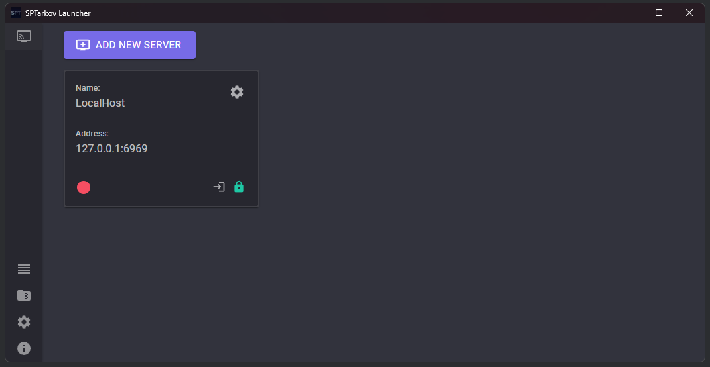
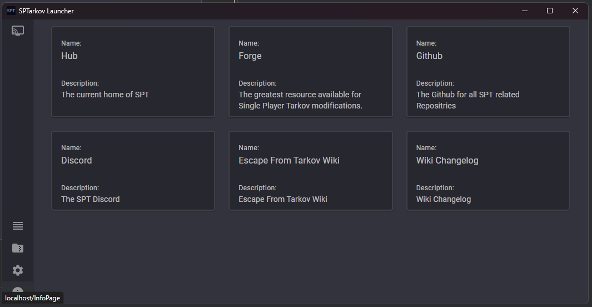
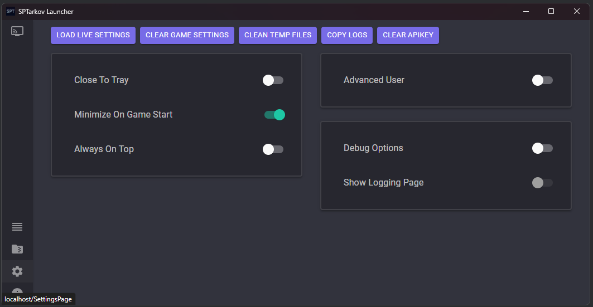
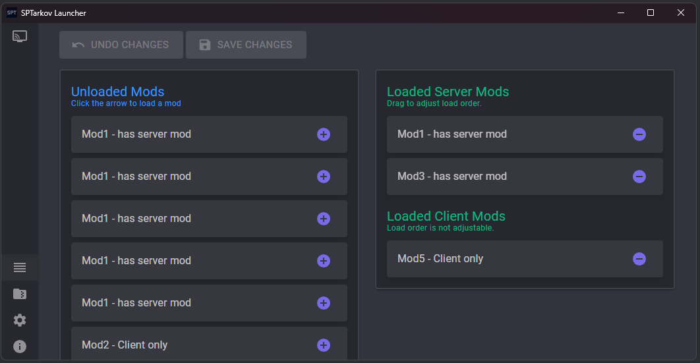
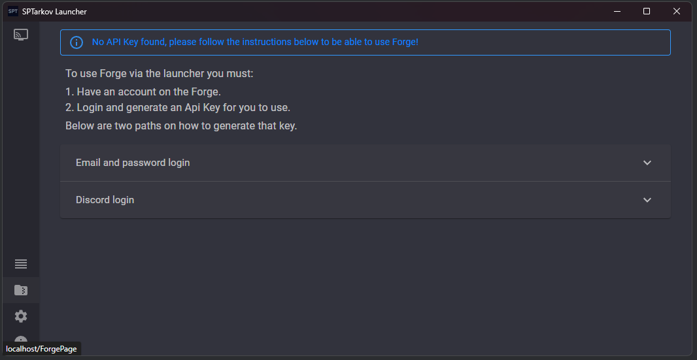

# SPTarkov.Launcher
Launcher for SPTarkov rewrite using Photino for cross platform support and Blazor for the UI

## Privacy
SPT is an open source project. Your commit credentials as author of a commit will be visible by anyone. Please make sure you understand this before submitting a PR.
Feel free to use a "fake" username and email on your commits by using the following commands:
```bash
git config --local user.name "USERNAME"
git config --local user.email "USERNAME@SOMETHING.com"
```

## Requirements
- Escape From Tarkov 38114
- Dotnet 9 SDK
- Visual Studio Code / Visual Studio / Rider
- [PowerShell v7](https://learn.microsoft.com/en-us/powershell/scripting/install/installing-powershell-on-windows&#41)

## Build
- Run `PublishWin.ps1` for windows exe
- Run `PublishLinux.ps1` for linux exe

## Server Endpoints
[Postman Collection - WIP](https://github.com/sp-tarkov/server-csharp/blob/develop/SPT%20C%23%20Postman%20Collection.postman_collection.json)

## Pages










